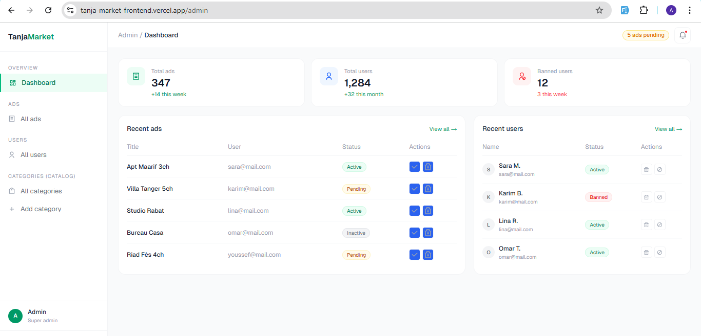
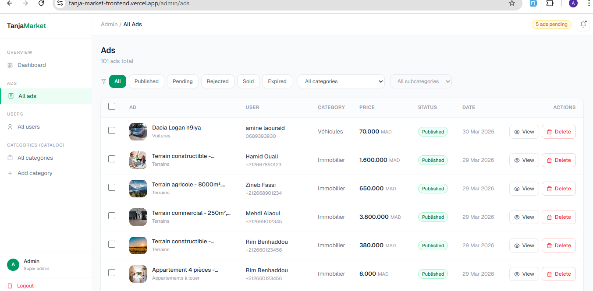
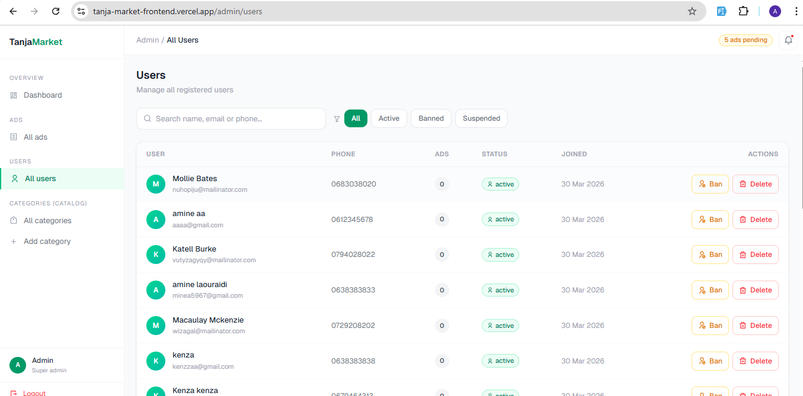
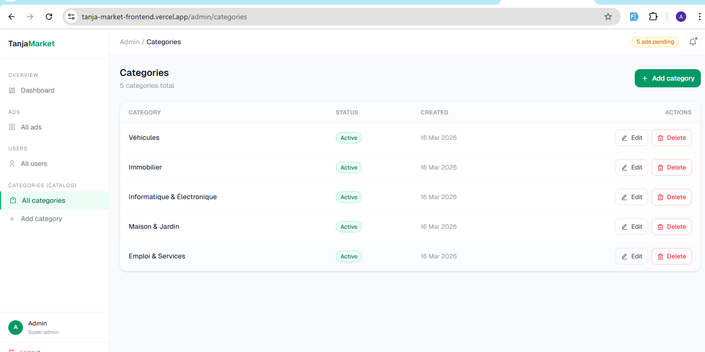

# TanjaMarket

A classified ads platform for Tanger, Morocco. Users can post, search and browse ads across multiple categories.

🔗 **Live:** [tanja-market-frontend.vercel.app](https://tanja-market-frontend.vercel.app)  
🔗 **Backend:** [TanjaMarket-Backend](https://github.com/amine-laouraidi/TanjaMarket-Backend)

---

## Screenshots

### Admin dashboard


### Admin — All ads


### Admin — Users


### Admin — Categories


---

## What I built

I built this project to practice building a full stack app from scratch. The idea came from wanting something like Avito.ma but focused on Tanger.

Users can:
- Create an account and post ads
- Browse and search ads by category, price or location
- Save ads they're interested in
- Contact sellers via WhatsApp or phone
- Manage their profile and their ads

Admins can:
- View dashboard stats (total ads, users, banned accounts)
- Manage all ads (approve, reject, delete)
- Manage all users (ban, delete)
- Manage categories and subcategories
- Add custom field templates per subcategory (brand, fuel type, etc.)

---

## Tech

- **Next.js** (App Router)
- **Tailwind CSS**
- **shadcn/ui**

---

## Run locally

```bash
git clone https://github.com/amine-laouraidi/tanjaMarket-frontend.git
cd tanjaMarket-frontend
npm install
npm run dev
```

Create a `.env.local` file:

```env
NEXT_PUBLIC_API_URL=http://localhost:5000/api
BACKEND_URL=http://localhost:5000/api
NEXT_PUBLIC_DOMAIN=http://localhost:3000
```

---

## Notes

This is a portfolio project — still a work in progress. Feedback is welcome.